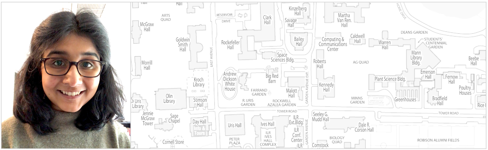

<picture>
    <source media="(min-width: 551px)" srcset="files/Banner.png">
    <source media="(max-width: 550px)" srcset="files/Banner-Resized.png">
    
</picture>

# Sara Venkatraman

Email: skv24 [at] cornell.edu  
<a href="https://scholar.google.com/citations?user=Ywm1z54AAAAJ&hl=en">Google Scholar</a> &nbsp;&#8226;&nbsp;
<a href="https://twitter.com/SaraVenkatraman">Twitter</a> &nbsp;&#8226;&nbsp;
<a href="https://github.com/sara-venkatraman">GitHub</a> &nbsp;&#8226;&nbsp;
<a href="https://www.linkedin.com/in/saravenkatraman">LinkedIn</a>

Welcome! I am a third-year PhD student in the Department of Statistics and Data Science at [Cornell University](https://stat.cornell.edu), where I am advised by Professors [Martin Wells](https://stat.cornell.edu/people/faculty/martin-wells) and [Sumanta Basu](http://faculty.bscb.cornell.edu/~basu/). My research interests are broadly in the analysis of time-evolving phenomena. I especially enjoy thinking about statistical theory and methods for recovering dynamical systems from data. I am also interested in problems in network science, numerical analysis, and optimal transport, as well as applications of statistics to demography and public health. 

Previously, I studied statistics at [Yale University](https://statistics.yale.edu) as a master's student and at Cornell as an undergraduate.

## Papers

* **An empirical Bayes approach to estimating dynamic models of co-regulated gene expression.** Sara Venkatraman, Sumanta Basu, Andrew G. Clark, Sofie Delbare, Myung Hee Lee, Martin T. Wells. \
[*Submitted*, 2021.](https://arxiv.org/abs/2112.15326) [IISA Student Paper Competition Winner.](https://stat.cornell.edu/news/venkatraman-lands-student-research-award) \
[PDF](https://arxiv.org/pdf/2112.15326.pdf) &nbsp;&#8226;&nbsp;
[Code](https://github.com/sara-venkatraman/Bayesian-Gene-Dynamics) &nbsp;&#8226;&nbsp;
[Slides](/files/slides/BayesianGeneDynamics.pdf) &nbsp;&#8226;&nbsp; 
[Video](https://www.youtube.com/watch?v=-OyCig5lKUA)

* **Association between city-wide lockdown and COVID-19 hospitalization rates in multigenerational households in New York City.** Arnab K. Ghosh\*, Sara Venkatraman\*, Evgeniya Reshetnyak, Mangala Rajan, Anjile An, John K. Chae, Mark A. Unruh, David Abramson, Charles DiMaggio, Nathaniel Hupert. \
[*PLOS ONE*, 2022.](https://journals.plos.org/plosone/article?id=10.1371/journal.pone.0266127) \
[PDF](https://journals.plos.org/plosone/article/file?id=10.1371/journal.pone.0266127&type=printable) &nbsp;&#8226;&nbsp;
[Cornell Statistics article](https://stat.cornell.edu/news/cornell-statisticians-physicians-team-fight-covid-19)

* **Association between neighborhood overcrowdedness, multigenerational households, and COVID-19 in New York City.** Arnab K. Ghosh\*, Sara Venkatraman\*, Orysya Soroka, Evgeniya Reshetnyak, Mangala Rajan, Anjile An, John K. Chae, Christopher Gonzalez, Jonathan Prince, Charles DiMaggio, Said Ibrahim, Monika M. Safford, Nathaniel Hupert. \
[*Public Health*, 2021.](https://www.sciencedirect.com/science/article/pii/S0033350621003097) \
[PDF](https://www.sciencedirect.com/science/article/pii/S0033350621003097/pdfft?md5=9620860c5e73dbdc1432fce02b27f194&pid=1-s2.0-S0033350621003097-main.pdf) &nbsp;&#8226;&nbsp;
[Slides](/files/slides/COVID19Dynamics.pdf) &nbsp;&#8226;&nbsp;
[Video](https://www.youtube.com/watch?v=Ib9VkkFQeBc)

* denotes co-first authorship.

## More about me

I am from Los Angeles, California and have also lived in France, where I attended middle and high school, and the United Kingdom. Outside of statistics, I enjoy classical piano, painting, [photography](/photos.html), and [running](https://github.com/sara-venkatraman/Running). My favorite dataset is the [New York Philharmonic Performance History Database](https://github.com/nyphilarchive/PerformanceHistory).

I co-organize the math/statistics [Directed Reading Program](https://sites.google.com/cornell.edu/cornell-drp) at Cornell, which pairs undergraduates with PhD students to work on semester-long reading projects on topics of mutual interest.

---

Last updated: March 2022.  
Source code available <a href="https://github.com/sara-venkatraman/sara-venkatraman.github.io" style="color: #748ea6">here</a>.

